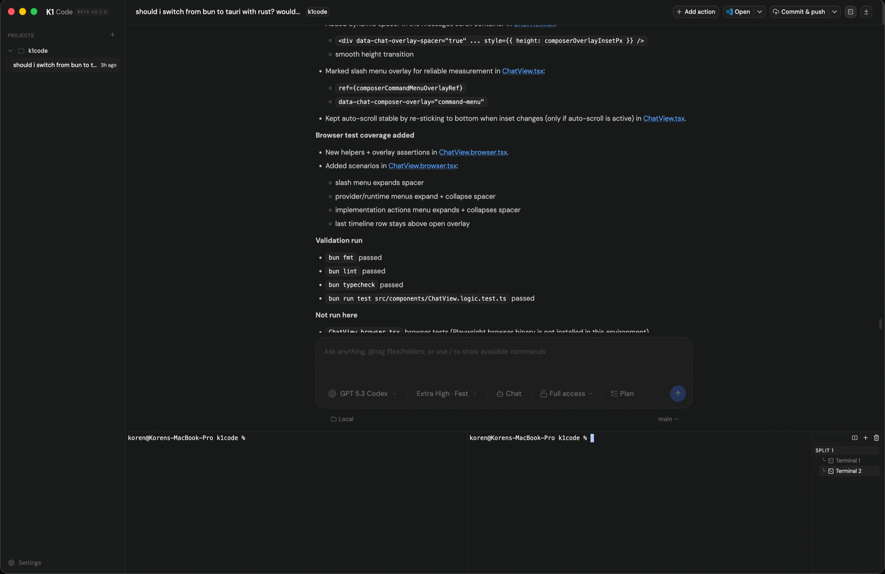

# K1 Code

K1 Code is a minimal desktop UI for interacting with coding agents like Codex, Claude, and Gemini — all in one place.

It focuses on speed, simplicity, and a clean workflow without unnecessary clutter.

---

## ✨ Features

- 🔌 Multi-agent support  
  - Codex (OpenAI)  
  - Claude (Anthropic)  
  - Gemini (Google)
  - Copilot (GitHub)
  - OpenCode / Cursor
- ⚡ Lightweight desktop app (Tauri)
- 🧠 Streamed responses (fast feedback)
- 💻 Clean, minimal interface
- 🔄 Easily extendable for more agents

---

## 📦 Installation

Download the latest desktop build from the releases page:

👉 https://github.com/kkorenn/k1code/releases

---

## ⚠️ Requirements

K1 Code relies on official CLI tools or local environments for each provider.  
You must install and authenticate them before using the app.

### Required CLIs / Tools

- **Codex (OpenAI)**  
  https://github.com/openai/codex  

- **Gemini (Google)**  
  https://github.com/google-gemini/gemini-cli  

- **Claude (Anthropic)**  
  https://github.com/anthropics/claude-code  

- **Copilot (GitHub)**  
  https://github.com/features/copilot  

- **Cursor**  
  https://cursor.sh  

- **OpenCode**  
  https://opencode.ai  

---

> [!NOTE]
> K1 Code does not replace these tools — it acts as a unified interface on top of them.

K1 Code uses these locally — it does NOT replace them.

---

## 🚀 Usage

1. Install the desktop app
2. Make sure your CLI tools are installed & logged in
3. Launch K1 Code
4. Start chatting with your coding agents

---

## 🖼 Screenshots

<!-- Add your images here -->

---

## 🛠 Tech Stack

- Tauri (desktop shell)
- React + Vite (frontend)
- Node / Bun (tooling)

---

## 🤝 Contributing

Pull requests are welcome.

Even small improvements or fixes are appreciated.

---

## 📄 License

MIT © 2026 Koren
